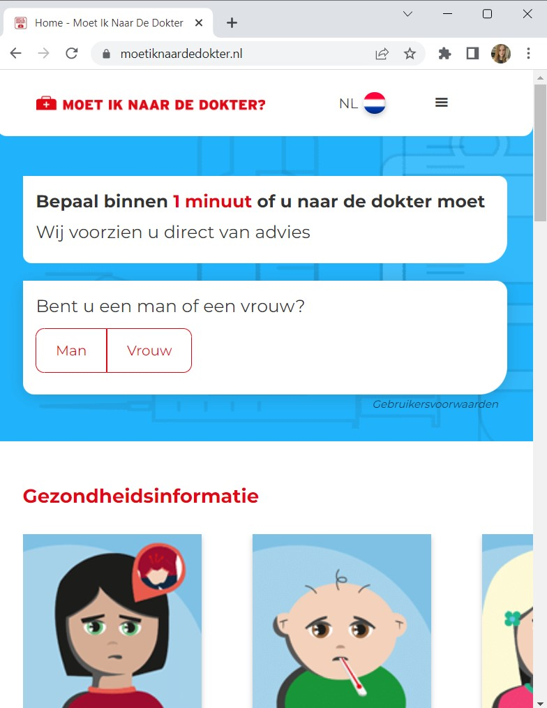
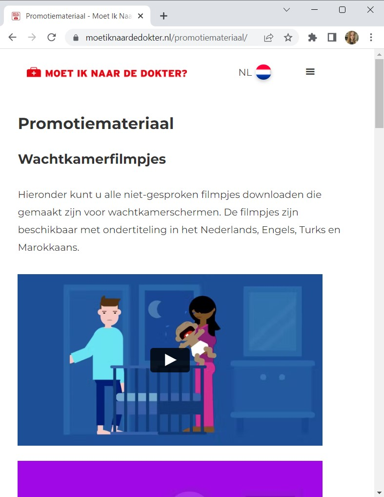

# Procesverslag
Markdown is een simpele manier om HTML te schrijven.  
Markdown cheat cheet: [Hulp bij het schrijven van Markdown](https://github.com/adam-p/markdown-here/wiki/Markdown-Cheatsheet).

Nb. De standaardstructuur en de spartaanse opmaak van de README.md zijn helemaal prima. Het gaat om de inhoud van je procesverslag. Besteedt de tijd voor pracht en praal aan je website.

Nb. Door *open* toe te voegen aan een *details* element kun je deze standaard open zetten. Fijn om dat steeds voor de relevante stuk(ken) te doen.

## Jij

  
uitwerken voor kick-off werkgroep

  ### Auteur:
  Britney van Zijl

  #### Je startniveau:
  Blauw / rood

  #### Je focus:
  surface plane
 

## Je website

  
uitwerken voor kick-off werkgroep

  ### Je opdracht:
 https://www.moetiknaardedokter.nl/

  #### Screenshot(s) van de eerste pagina (small screen): 
  Homepagina van MINDD
  
  

  #### Screenshot(s) van de tweede pagina (small screen):
  Promotiemateriaal pagina van MINDD
  
  
 

## Toegankelijkheidstest 1/2 (week 1)

  
uitwerken na test in 1e werkgroep

  ### Bevindingen
  Lijst met je bevindingen die in de test naar voren kwamen:

  #### Screenreader
  Hier korte omschrijving (met indien nodig afbeeldingen)
  
- logo heeft een alt tekst. (Uitleg van wat het is)
- talen worden in de engelse reader nog steeds nederlands opgenoemd
- bij de widget is de tekst onduidelijk dat je een vragenlijst gaat invullen
- vraag 2 widget: het invul veld word gelijk opgenoemd en niet de vraag
  Hier een omschrijving van hoe het opgelost kan worden (met indien nodig afbeeldingen)

  
  #### Muis en Toetsenbord 
  Hier korte omschrijving (met indien nodig afbeeldingen)

  Hier een omschrijving van hoe het opgelost kan worden (met indien nodig afbeeldingen)

  
  #### Motoriek (shocks, elastiekjes)
  Hier korte omschrijving (met indien nodig afbeeldingen)
  
- goed toegankelijk
- ondertiteling filmpjes talen zijn beperkt
- buttons zijn groot genoeg om op te klikken

  Hier een omschrijving van hoe het opgelost kan worden (met indien nodig afbeeldingen)

  
  #### Visueel (brillen, contrast, kleurenblind, dark/light). 
  Hier korte omschrijving (met indien nodig afbeeldingen)
  
- Darkmodus: niet aanwezig
- Kleurenblind: de kleuren zijn nog steeds goed te onderscheiden van elkaar
- Contrast: contrast is goed. Buttons zien er alleen niet altijd uit als buttons.
  
  Hier een omschrijving van hoe het opgelost kan worden (met indien nodig afbeeldingen)

## Breakdownschets (week 1)

  
uitwerken na afloop 2e werkgroep

  ### de hele pagina: 
  

  ### dynamisch deel (bijv menu): 
  

  ### wellicht nog een dynamisch deel (bijv filter): 
  

## Voortgang 1 (week 2)

  
uitwerken voor 1e voortgang

  ### Stand van zaken
  hier dit ging goed & dit was lastig (neem ook screenshots op van delen van je website en code)

  ### Agenda voor meeting
  samen met je groepje opstellen

  | student 1      | student 2          | student 3    | student 4        |
  | ---            | ---                | ---          | ---              |
  | dit bespreken  | en dit             | en ik dit    | en dan ik dat    |
  | en dat ook nog | dit als er tijd is | nog een punt | dit wil ik zeker |
  | ...            | ...                | ...          | ...              |

  ### Verslag van meeting
  hier na afloop snel de uitkomsten van de meeting vastleggen

  - punt 1
  - punt 2
  - nog een punt
  - ...

## Voortgang 2 (week 3)

  
uitwerken voor 2e voortgang

  ### Stand van zaken
  hier dit ging goed & dit was lastig (neem ook screenshots op van delen van je website en code)
  - Het maken van een drop down menu was lastig en ik vind het lastig dat ik geen id's en classes mag gebruiken voor de styling.

  ### Agenda voor meeting
  samen met je groepje opstellen

  | student 1      | student 2          | student 3    | student 4        
  | @media
  | Drop down menu
  | Grid maken
  | Element namen bepalen | 

  ### Verslag van meeting
  hier na afloop snel de uitkomsten van de meeting vastleggen

  - punt 1: Drop down menu (klein en groot scherm) + animatie (behandeld)
  https://codepen.io/shooft/pen/gOzGoww
  https://codepen.io/shooft/pen/poVWpQQ
  - punt 2: @media hoe maak je je website responsive (behandeld)
  https://codepen.io/shooft/pen/YzLrEJo
  - punt 3: Grid maken voor je content (behandeld)
  
  - punt 4: Elementen herkennen / h1 verbergen voor zicht, maar wel leesbaar voor screenreader. (behandeld)
  https://alistapart.com/article/now-you-see-me/
  https://www.a11yproject.com/posts/how-to-hide-content/

## Toegankelijkheidstest 2/2 (week 4)

  
uitwerken na test in 8e werkgroep

  ### Bevindingen
  Lijst met je bevindingen die in de test naar voren kwamen (geef ook aan wat er verbeterd is):

  #### Screenreader
  Hier korte omschrijving (met indien nodig afbeeldingen)
  
- buttons worden niet als buttons aangegeven
- links zijn niet allemaal linkjes
+ Alle kopjes worden aangegeven
  
  
  Hier een omschrijving van hoe het opgelost kan worden (met indien nodig afbeeldingen)

  #### Muis en Toetsenbord 
  Hier korte omschrijving (met indien nodig afbeeldingen)

  tap:
- niet alle linkjes zijn nog linkjes
+ Alle links die in de html linkjes werken met tap

  hover:
- hover nog niet ingesteld
- hover over h1 en p ziet er uit alsof je kunt typen
  
  
  Hier een omschrijving van hoe het opgelost kan worden (met indien nodig afbeeldingen)

  #### Motoriek (shocks, elastiekjes)
  Hier korte omschrijving (met indien nodig afbeeldingen)

  concentratieproblemen:
- De ballon leidt te veel af, maar heeft niet met de website te maken

  Slechte motoriek:
+ scrollen werkt nog steeds
+ buttons zijn klikbaar
+ e-mail invullen werkt nog steeds

visuele beperking:

  vlekken in het oog=
- gebruikersvoorwaarden is niet niet zichtbaar
+ Site is verder nog prima zichtbaar

  tunnelvisie=
+ Site is goed zichtbaar
- Ik kon mijn muis niet vinden
   
  
  Hier een omschrijving van hoe het opgelost kan worden (met indien nodig afbeeldingen)

  #### Visueel (brillen, contrast, kleurenblind, dark/light). 
  Hier korte omschrijving (met indien nodig afbeeldingen)

  slecht ziend / kleuren:
- blurred vision: klachten namen zijn moeilijk leesbaar, gebruikersvoorwaarden is niet goed zichtbaar
+ kleuren zijn nog duidelijk
+ contrast is goed
- dark modus: niet aanwezig
  
  
  Hier een omschrijving van hoe het opgelost kan worden (met indien nodig afbeeldingen)

## Voortgang 3 (week 4)

  
uitwerken voor 3e voortgang

  ### Stand van zaken
  hier dit ging goed & dit was lastig (neem ook screenshots op van delen van je website en code)

  ### Agenda voor meeting
  samen met je groepje opstellen

  | student 1      | student 2          | student 3    | student 4        |
  | ---            | ---                | ---          | ---              |
  | dit bespreken  | en dit             | en ik dit    | en dan ik dat    |
  | en dat ook nog | dit als er tijd is | nog een punt | dit wil ik zeker |
  | ...            | ...                | ...          | ...              |

  ### Verslag van meeting
  hier na afloop snel de uitkomsten van de meeting vastleggen

  - punt 1
  - punt 2
  - nog een punt
  - ...

## Eindgesprek (week 5)

  
uitwerken voor eindgesprek

  ### Je uitkomst - karakteristiek screenshots:
  

  ### Dit ging goed/Heb ik geleerd: 
  Korte omschrijving met plaatjes

  

  ### Dit was lastig/Is niet gelukt:
  Korte omschrijving met plaatjes

  

## Bronnenlijst

  
continu bijhouden terwijl je werkt

  Nb. Wees specifiek ('css-tricks' als bron is bijv. niet specifiek genoeg).

  1. bron 1
  2. bron 2
  3. ...

